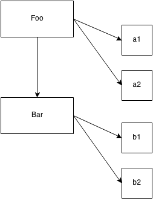

## Class Inheritance

In class-oriented languages, not only can you define a class which can be instantiated itself, but you can define another class that **inherits** from the first class.

The second class is often said to be a "child class" whereas the first is the "parent class". These terms obviously come from the metaphor of parents and children, though the metaphors here are a bit stretched, as you'll see shortly.

When a parent has a biological child, the genetic characteristics of the parent are copied into the child. Obviously, in most biological reproduction systems, there are two parents who co-equally contribute genes to the mix. But for the purposes of the metaphor, we'll assume just one parent.

Once the child exists, he or she is separate from the parent. The child was heavily influenced by the inheritance from his or her parent, but is unique and distinct. If a child ends up with red hair, that doesn't mean the parent's hair *was* or automatically *becomes* red.

In a similar way, once a child class is defined, it's separate and distinct from the parent class. The child class contains an initial copy of the behavior from the parent, but can then override any inherited behavior and even define new behavior.

It's important to remember that we're talking about parent and child **classes**, which aren't physical things. This is where the metaphor of parent and child gets a little confusing, because we actually should say that a parent class is like a parent's DNA and a child class is like a child's DNA. We have to make (aka "instantiate") a person out of each set of DNA to actually have a physical person to have a conversation with.

Let's set aside biological parents and children, and look at inheritance through a slightly different lens: different types of vehicles. That's one of the most canonical (and often groan-worthy) metaphors to understand inheritance.

Let's revisit the `Vehicle` and `Car` discussion from earlier in this chapter. Consider this loose pseudo-code (invented syntax) for inherited classes:

```js
class Vehicle {
	engines = 1

	ignition() {
		output( "Turning on my engine." );
	}

	drive() {
		ignition();
		output( "Steering and moving forward!" )
	}
}

class Car inherits Vehicle {
	wheels = 4

	drive() {
		inherited:drive()
		output( "Rolling on all ", wheels, " wheels!" )
	}
}

class SpeedBoat inherits Vehicle {
	engines = 2

	ignition() {
		output( "Turning on my ", engines, " engines." )
	}

	pilot() {
		inherited:drive()
		output( "Speeding through the water with ease!" )
	}
}
```

**Note:** For clarity and brevity, constructors for these classes have been omitted.

We define the `Vehicle` class to assume an engine, a way to turn on the ignition, and a way to drive around. But you wouldn't ever manufacture just a generic "vehicle", so it's really just an abstract concept at this point.

So then we define two specific kinds of vehicle: `Car` and `SpeedBoat`. They each inherit the general characteristics of `Vehicle`, but then they specialize the characteristics appropriately for each kind. A car needs 4 wheels, and a speed boat needs 2 engines, which means it needs extra attention to turn on the ignition of both engines.

### Polymorphism

`Car` defines its own `drive()` method, which overrides the method of the same name it inherited from `Vehicle`. But then, `Car`s `drive()` method calls `inherited:drive()`, which indicates that `Car` can reference the original pre-overridden `drive()` it inherited. `SpeedBoat`s `pilot()` method also makes a reference to its inherited copy of `drive()`.

This technique is called "polymorphism", or "virtual polymorphism". More specifically to our current point, we'll call it "relative polymorphism".

Polymorphism is a much broader topic than we will exhaust here, but our current "relative" semantics refers to one particular aspect: the idea that any method can reference another method (of the same or different name) at a higher level of the inheritance hierarchy. We say "relative" because we don't absolutely define which inheritance level (aka, class) we want to access, but rather relatively reference it by essentially saying "look one level up".

In many languages, the keyword `super` is used, in place of this example's `inherited:`, which leans on the idea that a "super class" is the parent/ancestor of the current class.

Another aspect of polymorphism is that a method name can have multiple definitions at different levels of the inheritance chain, and these definitions are automatically selected as appropriate when resolving which methods are being called.

We see two occurrences of that behavior in our example above: `drive()` is defined in both `Vehicle` and `Car`, and `ignition()` is defined in both `Vehicle` and `SpeedBoat`.

**Note:** Another thing that traditional class-oriented languages give you via `super` is a direct way for the constructor of a child class to reference the constructor of its parent class. This is largely true because with real classes, the constructor belongs to the class. However, in JS, it's the reverse -- it's actually more appropriate to think of the "class" belonging to the constructor (the `Foo.prototype...` type references). Since in JS the relationship between child and parent exists only between the two `.prototype` objects of the respective constructors, the constructors themselves are not directly related, and thus there's no simple way to relatively reference one from the other (see Appendix A for ES6 `class` which "solves" this with `super`).

An interesting implication of polymorphism can be seen specifically with `ignition()`. Inside `pilot()`, a relative-polymorphic reference is made to (the inherited) `Vehicle`s version of `drive()`. But that `drive()` references an `ignition()` method just by name (no relative reference).

Which version of `ignition()` will the language engine use, the one from `Vehicle` or the one from `SpeedBoat`? **It uses the `SpeedBoat` version of `ignition()`.** If you *were* to instantiate `Vehicle` class itself, and then call its `drive()`, the language engine would instead just use `Vehicle`s `ignition()` method definition.

Put another way, the definition for the method `ignition()` *polymorphs* (changes) depending on which class (level of inheritance) you are referencing an instance of.

This may seem like overly deep academic detail. But understanding these details is necessary to properly contrast similar (but distinct) behaviors in JavaScript's `[[Prototype]]` mechanism.

When classes are inherited, there is a way **for the classes themselves** (not the object instances created from them!) to *relatively* reference the class inherited from, and this relative reference is usually called `super`.

Remember this figure from earlier:



Notice how for both instantiation (`a1`, `a2`, `b1`, and `b2`) *and* inheritance (`Bar`), the arrows indicate a copy operation.

Conceptually, it would seem a child class `Bar` can access  behavior in its parent class `Foo` using a relative polymorphic reference (aka, `super`). However, in reality, the child class is merely given a copy of the inherited behavior from its parent class. If the child "overrides" a method it inherits, both the original and overridden versions of the method are actually maintained, so that they are both accessible.

Don't let polymorphism confuse you into thinking a child class is linked to its parent class. A child class instead gets a copy of what it needs from the parent class. **Class inheritance implies copies.**

### Multiple Inheritance

Recall our earlier discussion of parent(s) and children and DNA? We said that the metaphor was a bit weird because biologically most offspring come from two parents. If a class could inherit from two other classes, it would more closely fit the parent/child metaphor.

Some class-oriented languages allow you to specify more than one "parent" class to "inherit" from. Multiple-inheritance means that each parent class definition is copied into the child class.

On the surface, this seems like a powerful addition to class-orientation, giving us the ability to compose more functionality together. However, there are certainly some complicating questions that arise. If both parent classes provide a method called `drive()`, which version would a `drive()` reference in the child resolve to? Would you always have to manually specify which parent's `drive()` you meant, thus losing some of the gracefulness of polymorphic inheritance?

There's another variation, the so called "Diamond Problem", which refers to the scenario where a child class "D" inherits from two parent classes ("B" and "C"), and each of those in turn inherits from a common "A" parent. If "A" provides a method `drive()`, and both "B" and "C" override (polymorph) that method, when `D` references `drive()`, which version should it use (`B:drive()` or `C:drive()`)?


These complications go even much deeper than this quick glance. We address them here only so we can contrast to how JavaScript's mechanisms work.

JavaScript is simpler: it does not provide a native mechanism for "multiple inheritance". Many see this is a good thing, because the complexity savings more than make up for the "reduced" functionality. But this doesn't stop developers from trying to fake it in various ways, as we'll see next.

