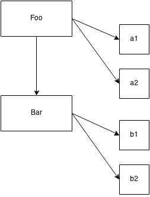

## Class Mechanics

In many class-oriented languages, the "standard library" provides a "stack" data structure (push, pop, etc.) as a `Stack` class. This class would have an internal set of variables that stores the data, and it would have a set of publicly accessible behaviors ("methods") provided by the class, which gives your code the ability to interact with the (hidden) data (adding & removing data, etc.).

But in such languages, you don't really operate directly on `Stack` (unless making a **Static** class member reference, which is outside the scope of our discussion). The `Stack` class is merely an abstract explanation of what *any* "stack" should do, but it's not itself *a* "stack". You must **instantiate** the `Stack` class before you have a concrete data structure *thing* to operate against.

### Building

The traditional metaphor for "class" and "instance" based thinking comes from a building construction.

An architect plans out all the characteristics of a building: how wide, how tall, how many windows and in what locations, even what type of material to use for the walls and roof. She doesn't necessarily care, at this point, *where* the building will be built, nor does she care *how many* copies of that building will be built.

She also doesn't care very much about the contents of the building -- the furniture, wall paper, ceiling fans, etc. -- only what type of structure they will be contained by.

The architectural blue-prints she produces are only *plans* for a building. They don't actually constitute a building we can walk into and sit down. We need a builder for that task. A builder will take those plans and follow them, exactly, as he *builds* the building. In a very real sense, he is *copying* the intended characteristics from the plans to the physical building.

Once complete, the building is a physical instantiation of the blue-print plans, hopefully an essentially perfect *copy*. And then the builder can move to the open lot next door and do it all over again, creating yet another *copy*.

The relationship between building and blue-print is indirect. You can examine a blue-print to understand how the building was structured, for any parts where direct inspection of the building itself was insufficient. But if you want to open a door, you have to go to the building itself -- the blue-print merely has lines drawn on a page that *represent* where the door should be.

A class is a blue-print. To actually *get* an object we can interact with, we must build (aka, "instantiate") something from the class. The end result of such "construction" is an object, typically called an "instance", which we can directly call methods on and access any public data properties from, as necessary.

**This object is a *copy*** of all the characteristics described by the class.

You likely wouldn't expect to walk into a building and find, framed and hanging on the wall, a copy of the blue-prints used to plan the building, though the blue-prints are probably on file with a public records office. Similarly, you don't generally use an object instance to directly access and manipulate its class, but it is usually possible to at least determine *which class* an object instance comes from.

It's more useful to consider the direct relationship of a class to an object instance, rather than any indirect relationship between an object instance and the class it came from. **A class is instantiated into object form by a copy operation.**



As you can see, the arrows move from left to right, and from top to bottom, which indicates the copy operations that occur, both conceptually and physically.

### Constructor

Instances of classes are constructed by a special method of the class, usually of the same name as the class, called a *constructor*. This method's explicit job is to initialize any information (state) the instance will need.

For example, consider this loose pseudo-code (invented syntax) for classes:

```js
class CoolGuy {
	specialTrick = nothing

	CoolGuy( trick ) {
		specialTrick = trick
	}

	showOff() {
		output( "Here's my trick: ", specialTrick )
	}
}
```

To *make* a `CoolGuy` instance, we would call the class constructor:

```js
Joe = new CoolGuy( "jumping rope" )

Joe.showOff() // Here's my trick: jumping rope
```

Notice that the `CoolGuy` class has a constructor `CoolGuy()`, which is actually what we call when we say `new CoolGuy(..)`. We get an object back (an instance of our class) from the constructor, and we can call the method `showOff()`, which prints out that particular `CoolGuy`s special trick.

*Obviously, jumping rope makes Joe a pretty cool guy.*

The constructor of a class *belongs* to the class, almost universally with the same name as the class. Also, constructors pretty much always need to be called with `new` to let the language engine know you want to construct a *new* class instance.

