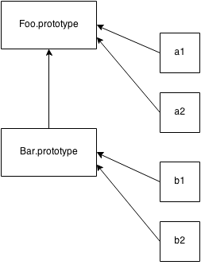

## "(Prototypal) Inheritance"

We've seen some approximations of "class" mechanics as typically hacked into JavaScript programs. But JavaScript "class"es would be rather hollow if we didn't have an approximation of "inheritance".

Actually, we've already seen the mechanism which is commonly called "prototypal inheritance" at work when `a` was able to "inherit from" `Foo.prototype`, and thus get access to the `myName()` function. But we traditionally think of "inheritance" as being a relationship between two "classes", rather than between "class" and "instance".



Recall this figure from earlier, which shows not only delegation from an object (aka, "instance") `a1` to object `Foo.prototype`, but from `Bar.prototype` to `Foo.prototype`, which somewhat resembles the concept of Parent-Child class inheritance. *Resembles*, except of course for the direction of the arrows, which show these are delegation links rather than copy operations.

And, here's the typical "prototype style" code that creates such links:

```js
function Foo(name) {
	this.name = name;
}

Foo.prototype.myName = function() {
	return this.name;
};

function Bar(name,label) {
	Foo.call( this, name );
	this.label = label;
}

// here, we make a new `Bar.prototype`
// linked to `Foo.prototype`
Bar.prototype = Object.create( Foo.prototype );

// Beware! Now `Bar.prototype.constructor` is gone,
// and might need to be manually "fixed" if you're
// in the habit of relying on such properties!

Bar.prototype.myLabel = function() {
	return this.label;
};

var a = new Bar( "a", "obj a" );

a.myName(); // "a"
a.myLabel(); // "obj a"
```

**Note:** To understand why `this` points to `a` in the above code snippet, see Chapter 2.

The important part is `Bar.prototype = Object.create( Foo.prototype )`. `Object.create(..)` *creates* a "new" object out of thin air, and links that new object's internal `[[Prototype]]` to the object you specify (`Foo.prototype` in this case).

In other words, that line says: "make a *new* 'Bar dot prototype' object that's linked to 'Foo dot prototype'."

When `function Bar() { .. }` is declared, `Bar`, like any other function, has a `.prototype` link to its default object. But *that* object is not linked to `Foo.prototype` like we want. So, we create a *new* object that *is* linked as we want, effectively throwing away the original incorrectly-linked object.

**Note:** A common mis-conception/confusion here is that either of the following approaches would *also* work, but they do not work as you'd expect:

```js
// doesn't work like you want!
Bar.prototype = Foo.prototype;

// works kinda like you want, but with
// side-effects you probably don't want :(
Bar.prototype = new Foo();
```

`Bar.prototype = Foo.prototype` doesn't create a new object for `Bar.prototype` to be linked to. It just makes `Bar.prototype` be another reference to `Foo.prototype`, which effectively links `Bar` directly to **the same object as** `Foo` links to: `Foo.prototype`. This means when you start assigning, like `Bar.prototype.myLabel = ...`, you're modifying **not a separate object** but *the* shared `Foo.prototype` object itself, which would affect any objects linked to `Foo.prototype`. This is almost certainly not what you want. If it *is* what you want, then you likely don't need `Bar` at all, and should just use only `Foo` and make your code simpler.

`Bar.prototype = new Foo()` **does in fact** create a new object which is duly linked to `Foo.prototype` as we'd want. But, it used the `Foo(..)` "constructor call" to do it. If that function has any side-effects (such as logging, changing state, registering against other objects, **adding data properties to `this`**, etc.), those side-effects happen at the time of this linking (and likely against the wrong object!), rather than only when the eventual `Bar()` "descendents" are created, as would likely be expected.

So, we're left with using `Object.create(..)` to make a new object that's properly linked, but without having the side-effects of calling `Foo(..)`. The slight downside is that we have to create a new object, throwing the old one away, instead of modifying the existing default object we're provided.

It would be *nice* if there was a standard and reliable way to modify the linkage of an existing object. Prior to ES6, there's a non-standard and not fully-cross-browser way, via the `.__proto__` property, which is settable. ES6 adds a `Object.setPrototypeOf(..)` helper utility, which does the trick in a standard and predictable way.

Compare the pre-ES6 and ES6-standardized techniques for linking `Bar.prototype` to `Foo.prototype`, side-by-side:

```js
// pre-ES6
// throws away default existing `Bar.prototype`
Bar.prototype = Object.create( Foo.prototype );

// ES6+
// modifies existing `Bar.prototype`
Object.setPrototypeOf( Bar.prototype, Foo.prototype );
```

Ignoring the slight performance disadvantage (throwing away an object that's later garbage collected) of the `Object.create(..)` approach, it's a little bit shorter and may be perhaps a little easier to read than the ES6+ approach. But it's probably a syntactic wash either way.

### Inspecting "Class" Relationships

What if you have an object like `a` and want to find out what object (if any) it delegates to? Inspecting an instance (just an object in JS) for its inheritance ancestry (delegation linkage in JS) is often called *introspection* (or *reflection*) in traditional class-oriented environments.

Consider:

```js
function Foo() {
	// ...
}

Foo.prototype.blah = ...;

var a = new Foo();
```

How do we then introspect `a` to find out its "ancestry" (delegation linkage)? The first approach embraces the "class" confusion:

```js
a instanceof Foo; // true
```

The `instanceof` operator takes a plain object as its left-hand operand and a **function** as its right-hand operand. The question `instanceof` answers is: **in the entire `[[Prototype]]` chain of `a`, does the object arbitrarily pointed to by `Foo.prototype` ever appear?**

Unfortunately, this means that you can only inquire about the "ancestry" of some object (`a`) if you have some **function** (`Foo`, with its attached `.prototype` reference) to test with. If you have two arbitrary objects, say `a` and `b`, and want to find out if *the objects* are related to each other through a `[[Prototype]]` chain, `instanceof` alone can't help.

**Note:** If you use the built-in `.bind(..)` utility to make a hard-bound function (see Chapter 2), the function created will not have a `.prototype` property. Using `instanceof` with such a function transparently substitutes the `.prototype` of the *target function* that the hard-bound function was created from.

It's fairly uncommon to use hard-bound functions as "constructor calls", but if you do, it will behave as if the original *target function* was invoked instead, which means that using `instanceof` with a hard-bound function also behaves according to the original function.

This snippet illustrates the ridiculousness of trying to reason about relationships between **two objects** using "class" semantics and `instanceof`:

```js
// helper utility to see if `o1` is
// related to (delegates to) `o2`
function isRelatedTo(o1, o2) {
	function F(){}
	F.prototype = o2;
	return o1 instanceof F;
}

var a = {};
var b = Object.create( a );

isRelatedTo( b, a ); // true
```

Inside `isRelatedTo(..)`, we borrow a throw-away function `F`, reassign its `.prototype` to arbitrarily point to some object `o2`, then ask if `o1` is an "instance of" `F`. Obviously `o1` wasn't *actually* inherited or descended or even constructed from `F`, so it should be clear why this kind of exercise is silly and confusing. **The problem comes down to the awkwardness of class semantics forced upon JavaScript**, in this case as revealed by the indirect semantics of `instanceof`.

The second, and much cleaner, approach to `[[Prototype]]` reflection is:

```js
Foo.prototype.isPrototypeOf( a ); // true
```

Notice that in this case, we don't really care about (or even *need*) `Foo`, we just need an **object** (in our case, arbitrarily labeled `Foo.prototype`) to test against another **object**. The question `isPrototypeOf(..)` answers is: **in the entire `[[Prototype]]` chain of `a`, does `Foo.prototype` ever appear?**

Same question, and exact same answer. But in this second approach, we don't actually need the indirection of referencing a **function** (`Foo`) whose `.prototype` property will automatically be consulted.

We *just need* two **objects** to inspect a relationship between them. For example:

```js
// Simply: does `b` appear anywhere in
// `c`s [[Prototype]] chain?
b.isPrototypeOf( c );
```

Notice, this approach doesn't require a function ("class") at all. It just uses object references directly to `b` and `c`, and inquires about their relationship. In other words, our `isRelatedTo(..)` utility above is built-in to the language, and it's called `isPrototypeOf(..)`.

We can also directly retrieve the `[[Prototype]]` of an object. As of ES5, the standard way to do this is:

```js
Object.getPrototypeOf( a );
```

And you'll notice that object reference is what we'd expect:

```js
Object.getPrototypeOf( a ) === Foo.prototype; // true
```

Most browsers (not all!) have also long supported a non-standard alternate way of accessing the internal `[[Prototype]]`:

```js
a.__proto__ === Foo.prototype; // true
```

The strange `.__proto__` (not standardized until ES6!) property "magically" retrieves the internal `[[Prototype]]` of an object as a reference, which is quite helpful if you want to directly inspect (or even traverse: `.__proto__.__proto__...`) the chain.

Just as we saw earlier with `.constructor`, `.__proto__` doesn't actually exist on the object you're inspecting (`a` in our running example). In fact, it exists (non-enumerable; see Chapter 2) on the built-in `Object.prototype`, along with the other common utilities (`.toString()`, `.isPrototypeOf(..)`, etc).

Moreover, `.__proto__` looks like a property, but it's actually more appropriate to think of it as a getter/setter (see Chapter 3).

Roughly, we could envision `.__proto__` implemented (see Chapter 3 for object property definitions) like this:

```js
Object.defineProperty( Object.prototype, "__proto__", {
	get: function() {
		return Object.getPrototypeOf( this );
	},
	set: function(o) {
		// setPrototypeOf(..) as of ES6
		Object.setPrototypeOf( this, o );
		return o;
	}
} );
```

So, when we access (retrieve the value of) `a.__proto__`, it's like calling `a.__proto__()` (calling the getter function). *That* function call has `a` as its `this` even though the getter function exists on the `Object.prototype` object (see Chapter 2 for `this` binding rules), so it's just like saying `Object.getPrototypeOf( a )`.

`.__proto__` is also a settable property, just like using ES6's `Object.setPrototypeOf(..)` shown earlier. However, generally you **should not change the `[[Prototype]]` of an existing object**.

There are some very complex, advanced techniques used deep in some frameworks that allow tricks like "subclassing" an `Array`, but this is commonly frowned on in general programming practice, as it usually leads to *much* harder to understand/maintain code.

**Note:** As of ES6, the `class` keyword will allow something that approximates "subclassing" of built-in's like `Array`. See Appendix A for discussion of the `class` syntax added in ES6.

The only other narrow exception (as mentioned earlier) would be setting the `[[Prototype]]` of a default function's `.prototype` object to reference some other object (besides `Object.prototype`). That would avoid replacing that default object entirely with a new linked object. Otherwise, **it's best to treat object `[[Prototype]]` linkage as a read-only characteristic** for ease of reading your code later.

**Note:** The JavaScript community unofficially coined a term for the double-underscore, specifically the leading one in properties like `__proto__`: "dunder". So, the "cool kids" in JavaScript would generally pronounce `__proto__` as "dunder proto".

