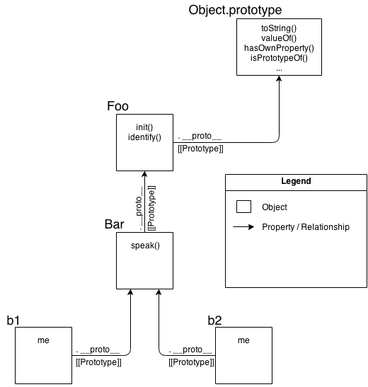

## Towards Delegation-Oriented Design

To properly focus our thoughts on how to use `[[Prototype]]` in the most straightforward way, we must recognize that it represents a fundamentally different design pattern from classes (see Chapter 4).

**Note:** *Some* principles of class-oriented design are still very valid, so don't toss out everything you know (just most of it!). For example, *encapsulation* is quite powerful, and is compatible (though not as common) with delegation.

We need to try to change our thinking from the class/inheritance design pattern to the behavior delegation design pattern. If you have done most or all of your programming in your education/career thinking in classes, this may be uncomfortable or feel unnatural. You may need to try this mental exercise quite a few times to get the hang of this very different way of thinking.

I'm going to walk you through some theoretical exercises first, then we'll look side-by-side at a more concrete example to give you practical context for your own code.

### Class Theory

Let's say we have several similar tasks ("XYZ", "ABC", etc) that we need to model in our software.

With classes, the way you design the scenario is: define a general parent (base) class like `Task`, defining shared behavior for all the "alike" tasks. Then, you define child classes `XYZ` and `ABC`, both of which inherit from `Task`, and each of which adds specialized behavior to handle their respective tasks.

**Importantly,** the class design pattern will encourage you that to get the most out of inheritance, you will want to employ method overriding (and polymorphism), where you override the definition of some general `Task` method in your `XYZ` task, perhaps even making use of `super` to call to the base version of that method while adding more behavior to it. **You'll likely find quite a few places** where you can "abstract" out general behavior to the parent class and specialize (override) it in your child classes.

Here's some loose pseudo-code for that scenario:

```js
class Task {
	id;

	// constructor `Task()`
	Task(ID) { id = ID; }
	outputTask() { output( id ); }
}

class XYZ inherits Task {
	label;

	// constructor `XYZ()`
	XYZ(ID,Label) { super( ID ); label = Label; }
	outputTask() { super(); output( label ); }
}

class ABC inherits Task {
	// ...
}
```

Now, you can instantiate one or more **copies** of the `XYZ` child class, and use those instance(s) to perform task "XYZ". These instances have **copies both** of the general `Task` defined behavior as well as the specific `XYZ` defined behavior. Likewise, instances of the `ABC` class would have copies of the `Task` behavior and the specific `ABC` behavior. After construction, you will generally only interact with these instances (and not the classes), as the instances each have copies of all the behavior you need to do the intended task.

### Delegation Theory

But now let's try to think about the same problem domain, but using *behavior delegation* instead of *classes*.

You will first define an **object** (not a class, nor a `function` as most JS'rs would lead you to believe) called `Task`, and it will have concrete behavior on it that includes utility methods that various tasks can use (read: *delegate to*!). Then, for each task ("XYZ", "ABC"), you define an **object** to hold that task-specific data/behavior. You **link** your task-specific object(s) to the `Task` utility object, allowing them to delegate to it when they need to.

Basically, you think about performing task "XYZ" as needing behaviors from two sibling/peer objects (`XYZ` and `Task`) to accomplish it. But rather than needing to compose them together, via class copies, we can keep them in their separate objects, and we can allow `XYZ` object to **delegate to** `Task` when needed.

Here's some simple code to suggest how you accomplish that:

```js
Task = {
	setID: function(ID) { this.id = ID; },
	outputID: function() { console.log( this.id ); }
};

// make `XYZ` delegate to `Task`
XYZ = Object.create( Task );

XYZ.prepareTask = function(ID,Label) {
	this.setID( ID );
	this.label = Label;
};

XYZ.outputTaskDetails = function() {
	this.outputID();
	console.log( this.label );
};

// ABC = Object.create( Task );
// ABC ... = ...
```

In this code, `Task` and `XYZ` are not classes (or functions), they're **just objects**. `XYZ` is set up via `Object.create(..)` to `[[Prototype]]` delegate to the `Task` object (see Chapter 5).

As compared to class-orientation (aka, OO -- object-oriented), I call this style of code **"OLOO"** (objects-linked-to-other-objects). All we *really* care about is that the `XYZ` object delegates to the `Task` object (as does the `ABC` object).

In JavaScript, the `[[Prototype]]` mechanism links **objects** to other **objects**. There are no abstract mechanisms like "classes", no matter how much you try to convince yourself otherwise. It's like paddling a canoe upstream: you *can* do it, but you're *choosing* to go against the natural current, so it's obviously **going to be harder to get where you're going.**

Some other differences to note with **OLOO style code**:

1. Both `id` and `label` data members from the previous class example are data properties directly on `XYZ` (neither is on `Task`). In general, with `[[Prototype]]` delegation involved, **you want state to be on the delegators** (`XYZ`, `ABC`), not on the delegate (`Task`).
2. With the class design pattern, we intentionally named `outputTask` the same on both parent (`Task`) and child (`XYZ`), so that we could take advantage of overriding (polymorphism). In behavior delegation, we do the opposite: **we avoid if at all possible naming things the same** at different levels of the `[[Prototype]]` chain (called shadowing -- see Chapter 5), because having those name collisions creates awkward/brittle syntax to disambiguate references (see Chapter 4), and we want to avoid that if we can.

   This design pattern calls for less of general method names which are prone to overriding and instead more of descriptive method names, *specific* to the type of behavior each object is doing. **This can actually create easier to understand/maintain code**, because the names of methods (not only at definition location but strewn throughout other code) are more obvious (self documenting).
3. `this.setID(ID);` inside of a method on the `XYZ` object first looks on `XYZ` for `setID(..)`, but since it doesn't find a method of that name on `XYZ`, `[[Prototype]]` *delegation* means it can follow the link to `Task` to look for `setID(..)`, which it of course finds. Moreover, because of implicit call-site `this` binding rules (see Chapter 2), when `setID(..)` runs, even though the method was found on `Task`, the `this` binding for that function call is `XYZ` exactly as we'd expect and want. We see the same thing with `this.outputID()` later in the code listing.

   In other words, the general utility methods that exist on `Task` are available to us while interacting with `XYZ`, because `XYZ` can delegate to `Task`.

**Behavior Delegation** means: let some object (`XYZ`) provide a delegation (to `Task`) for property or method references if not found on the object (`XYZ`).

This is an *extremely powerful* design pattern, very distinct from the idea of parent and child classes, inheritance, polymorphism, etc. Rather than organizing the objects in your mind vertically, with Parents flowing down to Children, think of objects side-by-side, as peers, with any direction of delegation links between the objects as necessary.

**Note:** Delegation is more properly used as an internal implementation detail rather than exposed directly in the API interface design. In the above example, we don't necessarily *intend* with our API design for developers to call `XYZ.setID()` (though we can, of course!). We sorta *hide* the delegation as an internal detail of our API, where `XYZ.prepareTask(..)` delegates to `Task.setID(..)`. See the "Links As Fallbacks?" discussion in Chapter 5 for more detail.

#### Mutual Delegation (Disallowed)

You cannot create a *cycle* where two or more objects are mutually delegated (bi-directionally) to each other. If you make `B` linked to `A`, and then try to link `A` to `B`, you will get an error.

It's a shame (not terribly surprising, but mildly annoying) that this is disallowed. If you made a reference to a property/method which didn't exist in either place, you'd have a infinite recursion on the `[[Prototype]]` loop. But if all references were strictly present, then `B` could delegate to `A`, and vice versa, and it *could* work. This would mean you could use either object to delegate to the other, for various tasks. There are a few niche use-cases where this might be helpful.

But it's disallowed because engine implementors have observed that it's more performant to check for (and reject!) the infinite circular reference once at set-time rather than needing to have the performance hit of that guard check every time you look-up a property on an object.

#### Debugged

We'll briefly cover a subtle detail that can be confusing to developers. In general, the JS specification does not control how browser developer tools should represent specific values/structures to a developer, so each browser/engine is free to interpret such things as they see fit. As such, browsers/tools *don't always agree*. Specifically, the behavior we will now examine is currently observed only in Chrome's Developer Tools.

Consider this traditional "class constructor" style JS code, as it would appear in the *console* of Chrome Developer Tools:

```js
function Foo() {}

var a1 = new Foo();

a1; // Foo {}
```

Let's look at the last line of that snippet: the output of evaluating the `a1` expression, which prints `Foo {}`. If you try this same code in Firefox, you will likely see `Object {}`. Why the difference? What do these outputs mean?

Chrome is essentially saying "{} is an empty object that was constructed by a function with name 'Foo'". Firefox is saying "{} is an empty object of general construction from Object". The subtle difference is that Chrome is actively tracking, as an *internal property*, the name of the actual function that did the construction, whereas other browsers don't track that additional information.

It would be tempting to attempt to explain this with JavaScript mechanisms:

```js
function Foo() {}

var a1 = new Foo();

a1.constructor; // Foo(){}
a1.constructor.name; // "Foo"
```

So, is that how Chrome is outputting "Foo", by simply examining the object's `.constructor.name`? Confusingly, the answer is both "yes" and "no".

Consider this code:

```js
function Foo() {}

var a1 = new Foo();

Foo.prototype.constructor = function Gotcha(){};

a1.constructor; // Gotcha(){}
a1.constructor.name; // "Gotcha"

a1; // Foo {}
```

Even though we change `a1.constructor.name` to legitimately be something else ("Gotcha"), Chrome's console still uses the "Foo" name.

So, it would appear the answer to previous question (does it use `.constructor.name`?) is **no**, it must track it somewhere else, internally.

But, Not so fast! Let's see how this kind of behavior works with OLOO-style code:

```js
var Foo = {};

var a1 = Object.create( Foo );

a1; // Object {}

Object.defineProperty( Foo, "constructor", {
	enumerable: false,
	value: function Gotcha(){}
});

a1; // Gotcha {}
```

Ah-ha! **Gotcha!** Here, Chrome's console **did** find and use the `.constructor.name`. Actually, while writing this book, this exact behavior was identified as a bug in Chrome, and by the time you're reading this, it may have already been fixed. So you may instead have seen the corrected `a1; // Object {}`.

Aside from that bug, the internal tracking (apparently only for debug output purposes) of the "constructor name" that Chrome does (shown in the earlier snippets) is an intentional Chrome-only extension of behavior beyond what the JS specification calls for.

If you don't use a "constructor" to make your objects, as we've discouraged with OLOO-style code here in this chapter, then you'll get objects that Chrome does *not* track an internal "constructor name" for, and such objects will correctly only be outputted as "Object {}", meaning "object generated from Object() construction".

**Don't think** this represents a drawback of OLOO-style coding. When you code with OLOO and behavior delegation as your design pattern, *who* "constructed" (that is, *which function* was called with `new`?) some object is an irrelevant detail. Chrome's specific internal "constructor name" tracking is really only useful if you're fully embracing "class-style" coding, but is moot if you're instead embracing OLOO delegation.

### Mental Models Compared

Now that you can see a difference between "class" and "delegation" design patterns, at least theoretically, let's see the implications these design patterns have on the mental models we use to reason about our code.

We'll examine some more theoretical ("Foo", "Bar") code, and compare both ways (OO vs. OLOO) of implementing the code. The first snippet uses the classical ("prototypal") OO style:

```js
function Foo(who) {
	this.me = who;
}
Foo.prototype.identify = function() {
	return "I am " + this.me;
};

function Bar(who) {
	Foo.call( this, who );
}
Bar.prototype = Object.create( Foo.prototype );

Bar.prototype.speak = function() {
	alert( "Hello, " + this.identify() + "." );
};

var b1 = new Bar( "b1" );
var b2 = new Bar( "b2" );

b1.speak();
b2.speak();
```

Parent class `Foo`, inherited by child class `Bar`, which is then instantiated twice as `b1` and `b2`. What we have is `b1` delegating to `Bar.prototype` which delegates to `Foo.prototype`. This should look fairly familiar to you, at this point. Nothing too ground-breaking going on.

Now, let's implement **the exact same functionality** using *OLOO* style code:

```js
Foo = {
	init: function(who) {
		this.me = who;
	},
	identify: function() {
		return "I am " + this.me;
	}
};

Bar = Object.create( Foo );

Bar.speak = function() {
	alert( "Hello, " + this.identify() + "." );
};

var b1 = Object.create( Bar );
b1.init( "b1" );
var b2 = Object.create( Bar );
b2.init( "b2" );

b1.speak();
b2.speak();
```

We take exactly the same advantage of `[[Prototype]]` delegation from `b1` to `Bar` to `Foo` as we did in the previous snippet between `b1`, `Bar.prototype`, and `Foo.prototype`. **We still have the same 3 objects linked together**.

But, importantly, we've greatly simplified *all the other stuff* going on, because now we just set up **objects** linked to each other, without needing all the cruft and confusion of things that look (but don't behave!) like classes, with constructors and prototypes and `new` calls.

Ask yourself: if I can get the same functionality with OLOO style code as I do with "class" style code, but OLOO is simpler and has less things to think about, **isn't OLOO better**?

Let's examine the mental models involved between these two snippets.

First, the class-style code snippet implies this mental model of entities and their relationships:


Actually, that's a little unfair/misleading, because it's showing a lot of extra detail that you don't *technically* need to know at all times (though you *do* need to understand it!). One take-away is that it's quite a complex series of relationships. But another take-away: if you spend the time to follow those relationship arrows around, **there's an amazing amount of internal consistency** in JS's mechanisms.

For instance, the ability of a JS function to access `call(..)`, `apply(..)`, and `bind(..)` (see Chapter 2) is because functions themselves are objects, and function-objects also have a `[[Prototype]]` linkage, to the `Function.prototype` object, which defines those default methods that any function-object can delegate to. JS can do those things, *and you can too!*.

OK, let's now look at a *slightly* simplified version of that diagram which is a little more "fair" for comparison -- it shows only the *relevant* entities and relationships.


Still pretty complex, eh? The dotted lines are depicting the implied relationships when you setup the "inheritance" between `Foo.prototype` and `Bar.prototype` and haven't yet *fixed* the **missing** `.constructor` property reference (see "Constructor Redux" in Chapter 5). Even with those dotted lines removed, the mental model is still an awful lot to juggle every time you work with object linkages.

Now, let's look at the mental model for OLOO-style code:



As you can see comparing them, it's quite obvious that OLOO-style code has *vastly less stuff* to worry about, because OLOO-style code embraces the **fact** that the only thing we ever really cared about was the **objects linked to other objects**.

All the other "class" cruft was a confusing and complex way of getting the same end result. Remove that stuff, and things get much simpler (without losing any capability).

